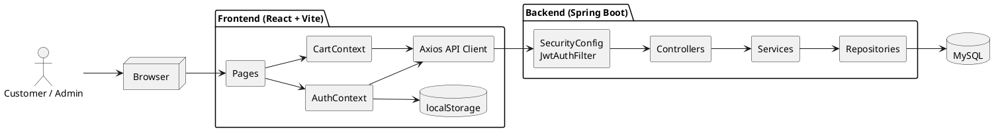
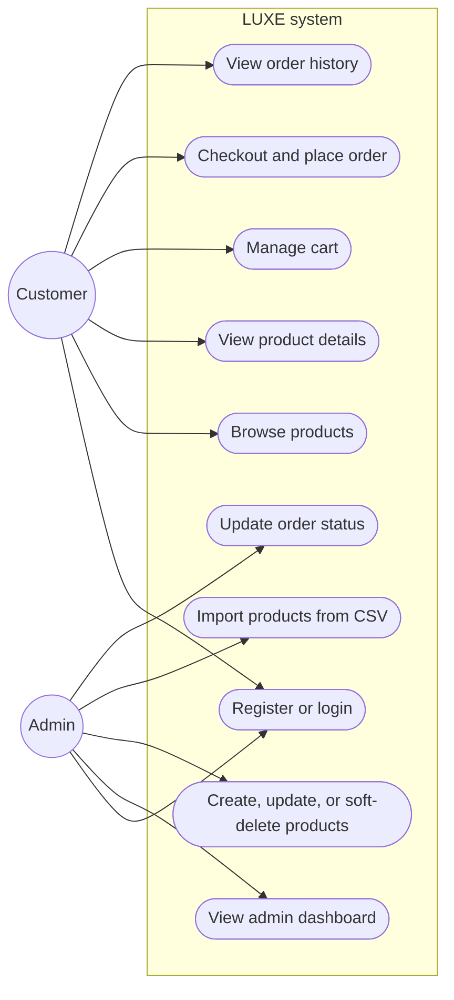
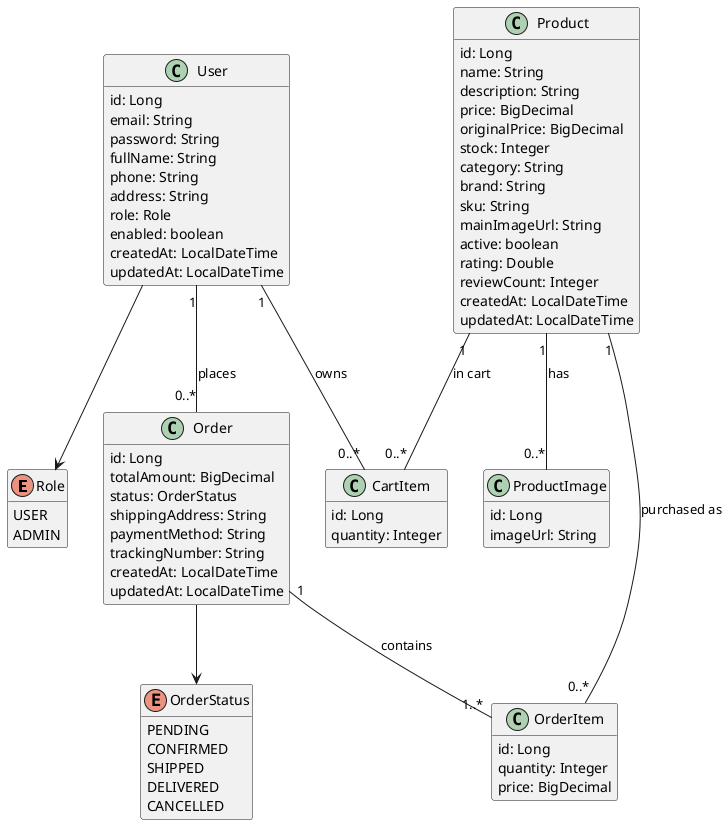
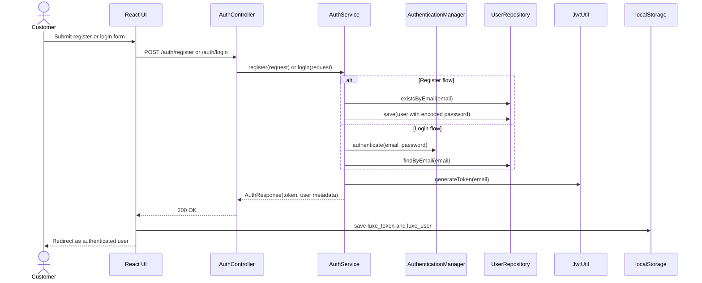
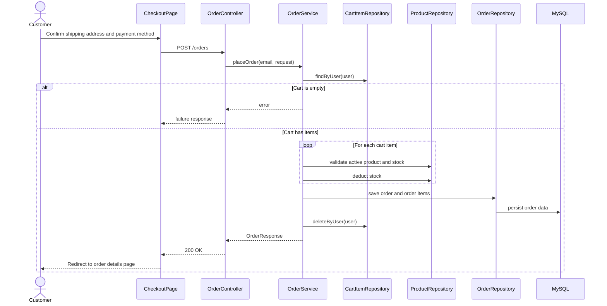
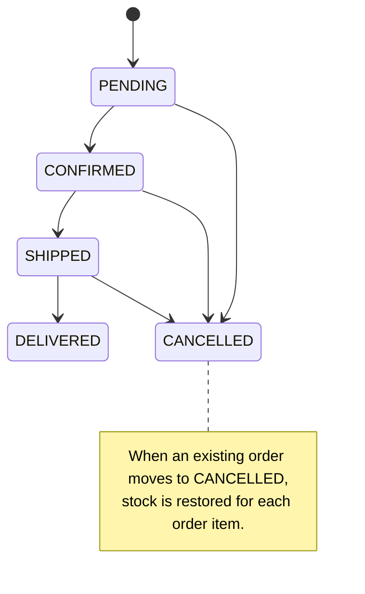
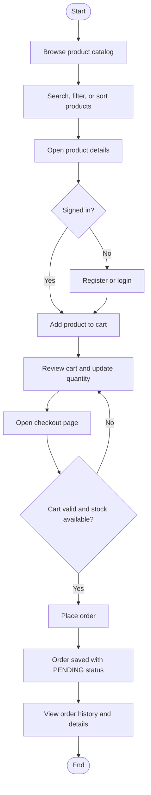
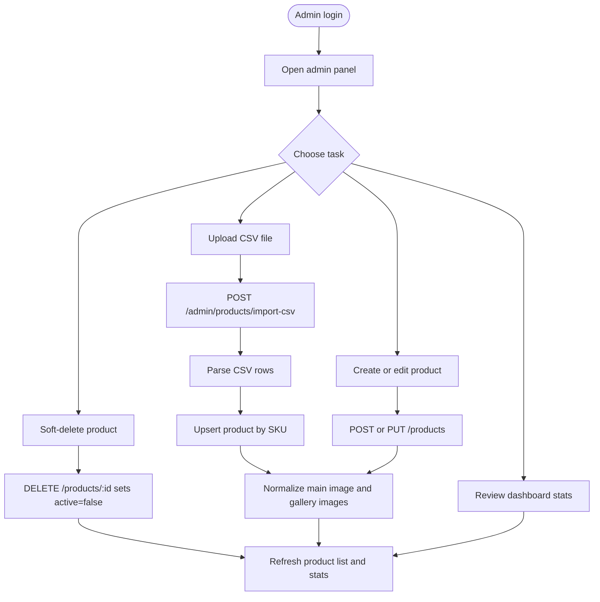
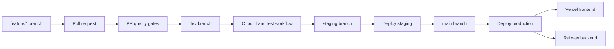
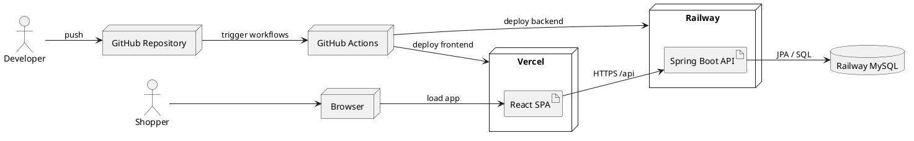

# LUXE Full-Stack E-Commerce Platform

LUXE is a monorepo for a full-stack e-commerce application built with Spring Boot, React, and MySQL. The codebase supports customer shopping flows, JWT-based authentication, order management, and admin catalog operations including CSV-based product import.

## Tech Stack

- Frontend: React 18, Vite, React Router, Axios, React Hot Toast, React Icons
- Backend: Spring Boot 3.2, Spring Web, Spring Data JPA, Spring Security, JWT, Validation, Lombok, Apache Commons CSV
- Database: MySQL 8
- DevOps: Docker Compose, GitHub Actions, Railway, Vercel

## Repository Structure

```text
luxe-fullstack/
|-- .github/
|   `-- workflows/
|       |-- ci.yml
|       |-- deploy-production.yml
|       |-- deploy-staging.yml
|       `-- pr-checks.yml
|-- backend/
|   |-- src/main/java/com/luxe/ecommerce/
|   |   |-- config/
|   |   |-- controller/
|   |   |-- dto/
|   |   |-- model/
|   |   |-- repository/
|   |   |-- security/
|   |   `-- service/
|   |-- src/main/resources/application.properties
|   |-- pom.xml
|   `-- Dockerfile
|-- frontend/
|   |-- public/product-import-template.csv
|   |-- src/
|   |   |-- components/
|   |   |-- context/
|   |   |-- pages/
|   |   |-- services/
|   |   |-- styles/
|   |   `-- utils/
|   |-- package.json
|   |-- vite.config.js
|   `-- vercel.json
|-- docker/
|   `-- docker-compose.yml
|-- docs/
|   |-- CONTRIBUTING.md
|   `-- DEPLOYMENT.md
|-- scripts/
|   `-- setup.sh
|-- product-import-template.csv
`-- README.md
```

## Architecture, UML, and Workflow Diagrams

The structural UML diagrams below use PlantUML and are embedded as rendered SVGs in the README. The sequence and workflow diagrams remain in Mermaid for direct GitHub rendering.

### 1. Structural Component Diagram


<details>
<summary>PlantUML source</summary>



</details>

### 2. Use Case Diagram



### 3. Structural Domain Class Diagram


<details>
<summary>PlantUML source</summary>



</details>

### 4. Authentication Sequence Diagram



### 5. Checkout and Order Placement Sequence Diagram



### 6. Order State Diagram



### 7. Customer Shopping Workflow



### 8. Admin Catalog Workflow



### 9. CI/CD Workflow



### 10. Structural Deployment Diagram


<details>
<summary>PlantUML source</summary>



</details>

## Key Business Rules Captured in the Code

- JWT tokens are created on login and registration, then stored in `localStorage` by the frontend.
- Product listing and product details are public; cart, checkout, orders, and admin endpoints require authentication.
- Admin-only routes are guarded with Spring Security role checks.
- Product deletion is a soft delete: `DELETE /products/{id}` sets `active=false`.
- Inactive products are pruned from carts the next time the cart is loaded or updated.
- Placing an order validates stock, deducts inventory, creates order items, and clears the cart.
- Cancelling an existing order restores stock for each order item.
- CSV imports upsert products by `sku` and build image galleries from the `images` column.

## API Overview

| Area | Endpoints |
|---|---|
| Auth | `POST /api/auth/register`, `POST /api/auth/login`, `POST /api/auth/google` |
| Products | `GET /api/products`, `GET /api/products/{id}`, `GET /api/products/categories`, `POST /api/products`, `PUT /api/products/{id}`, `DELETE /api/products/{id}` |
| Cart | `GET /api/cart`, `POST /api/cart`, `PUT /api/cart/{itemId}?quantity={n}`, `DELETE /api/cart` |
| Orders | `POST /api/orders`, `GET /api/orders`, `GET /api/orders/{id}`, `GET /api/orders/admin/all`, `PATCH /api/orders/{id}/status` |
| Admin | `GET /api/admin/stats`, `POST /api/admin/products/import-csv` |

## Local Development

### Prerequisites

- Java 17
- Maven 3.8+
- Node.js 18+
- npm
- Docker Desktop or Docker Engine

### Option 1: Setup Script

The repository includes `scripts/setup.sh` for bash-based environments such as Linux, macOS, Git Bash, or WSL.

```bash
chmod +x scripts/setup.sh
./scripts/setup.sh
```

### Option 2: Manual Setup

```bash
docker compose -f docker/docker-compose.yml up -d mysql
cd backend
mvn spring-boot:run
```

In a second terminal:

```bash
cd frontend
npm ci
npm run dev
```

### Local URLs

- Frontend: `http://localhost:3000`
- Backend API: `http://localhost:8080/api`
- Swagger UI: `http://localhost:8080/api/swagger-ui.html`
- CSV template: `http://localhost:3000/product-import-template.csv`

### Google Sign-In Configuration

To enable Google login and registration, configure the same Google OAuth client in both apps:

- Backend env: `GOOGLE_CLIENT_ID`
- Frontend env: `VITE_GOOGLE_CLIENT_ID`

The frontend sends the Google ID token to `POST /api/auth/google`, and the backend verifies it against the configured Google client ID before issuing the app's own JWT.

## Deployment Targets

| Environment | Frontend | Backend API |
|---|---|---|
| Production | `https://luxe.vercel.app` | `https://luxe-api.railway.app/api` |
| Staging | `https://luxe-staging.vercel.app` | `https://luxe-api-staging.railway.app/api` |

## Useful Commands

```bash
# Backend tests
cd backend
mvn test

# Backend package
cd backend
mvn clean package

# Frontend development
cd frontend
npm run dev

# Frontend production build
cd frontend
npm run build
```

## Related Docs

- `docs/DEPLOYMENT.md`
- `docs/CONTRIBUTING.md`
